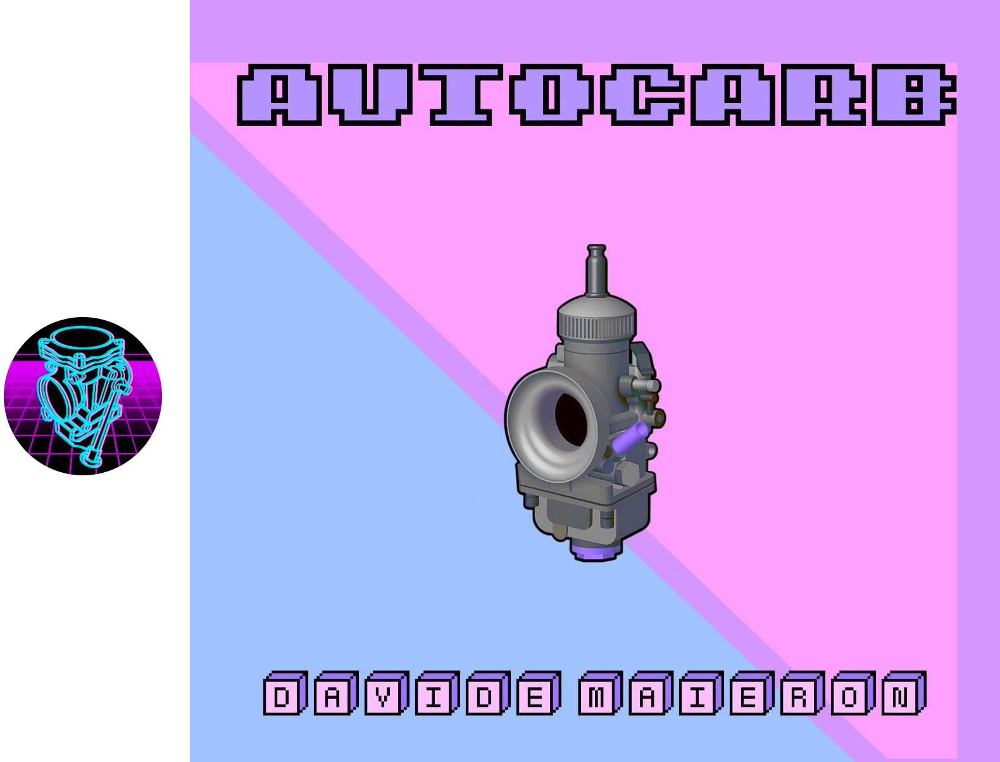

# AutoCARB for Android

This application verifies the carburation (i.e. air-fuel mixture) by means of an analytical model, which takes into consideration simplifying hypothesis.
1. Dynamic effects are neglected, assuming stationary airflow and gasoline flow.
   The dynamic effects are given by the periodic intake of fresh charge operated by each
   cylinder and they are present also in conditions of constant speed and load.
2. In new software version, the hypothesis of incompressible fluid is used only for gasoline, while air is considered as a perfect gas.
3. Pressure drops and heat exchanges with the walls up to the inlet section of the convergent are neglected.
4. It considers `Cc<Cd`, which are respectively the input speed and the output speed from the main jet.

The mathematical model is mainly based on the nozzle theory, in which the air is considered as an ideal gas subject to adiabatic transformations.
The estimation of the specific heat of the air at constant pressure is computed by means of the "Janaf tables".

The fuel, on the other hand, is considered as an incompressible fluid, although this hypothesis is an approximation, it is consistent with the physical nature of the fluid in question. 
 
As for the distributed losses, the program is able to calculate the friction factor, simulating the Moody diagram in almost a perfect way.
Finally, the head losses (distributed and concentrated) are considered by calculating the efflux coefficient, which in addition provides us with the contribution given by the contraction of the fluid vein. 

To learn more about the gasoline efflux coefficient equation that I used in the model, read the article published on [Matematicamente](https://www.matematicamente.it/forum/viewtopic.php?f=38&t=211382).

As for the coefficient used for air, I refer to the model for compressible fluids and sub-critical motion described and demonstrated in the [article](https://journals.sagepub.com/doi/10.1243/JMES_JOUR_1960_002_007_02) by Professor S.L.Bragg of the University of Pittsburgh.

## Download from the Play Store

AutoCARB can be downloaded from the following [link](https://play.google.com/store/apps/details?id=com.github.dogengineer.autocarb&hl=it&gl=US).

## User Manual

The instruction manual for perfect carburetion is available at [this address](https://drive.google.com/drive/folders/1R0lzU6_zJvO-YX1yDZe_P2RxIkCc_qsJ?usp=sharing).

## Interface

The AutoCARB homepage is structured such as:
1. In the center, you can find the inputs that you will have to enter to start the calculations.
2. Above the inputs you will find a float to select the "type" of your engine.
3. In the right corner you can find a button that brings you to the image containing all the dimensions required.
4. In the top right corner you can find the buttons to save and restore all the inputs.
5. In the top left corner you will find the menu, where you can access the manual, the contacts, the paypal link to support us and the button to change the application theme.

## Contributors

[Ing. Davide Maieron](https://www.linkedin.com/in/davide-maieron-3757851bb/) lead programmer and engineer.

[Ing. Adriano Mazzola](https://www.linkedin.com/in/adriano-mazzola/) engineering consultant and software designer.

[Roberta Carlevaris](https://www.instagram.com/robzilla.tattoo/) chief artist and designer

[antipatico](https://github.com/antipatico) git wizard and computer master.

[Alessio Lei](https://github.com/AlessioLei94) computer consultant.

## Contacts

app.autocarb@gmail.com

## Support Developer

If you wish you can follow the [PayPal link](https://www.paypal.com/paypalme/DavideMaieron) and you can make a small contribution to help and encourage us to work and develop on AutoCARB.

## License

The program is licensed [GPLv3](LICENSE).
